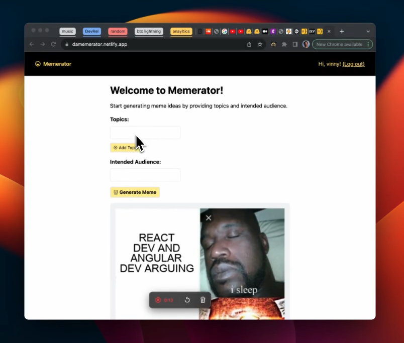

# Memerator

This repo is a clone of [vincanger/memerator](https://github.com/vincanger/memerator), which was created after going through the excellent accompanying blogpost - [Build your own AI Meme Generator & learn how to use OpenAI's function calls](https://wasp.sh/blog/2023/09/17/ai-meme-generator-how-to-use-openai-function-call).

The original app was built using Wasp `0.11.x`. This repo updates the project structure to now be compatible with Wasp `0.17.1`. The project also updates several dependencies to the latest Wasp compatible versions (including `openai` and `react-router-dom`).

## Original README

This is a repo for the Memerator meme generator app: <https://damemerator.netlify.app/>

It uses:

- [Wasp](https://wasp-lang.dev/) a full-stack React/NodeJS framework
- OpenAI's function calling API to call imgflip.com's API to generate memes

Please see the tutorial on how to build this app: <https://dev.to/wasp/build-your-own-ai-meme-generator-learn-how-to-use-openais-function-calls-1p21>
